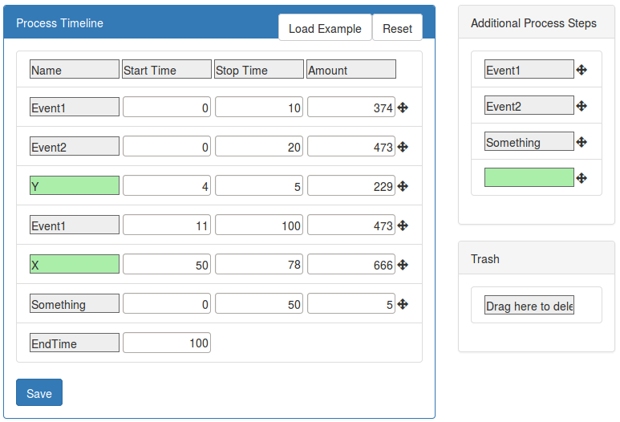
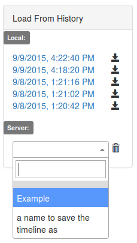
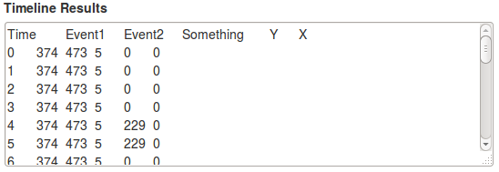

# Timeline Editor #

Creates a tab-delimited timeline of events based on specified intervals.  
The purpose of a timeline editor is for quickly prototyping different inputs for modelling/simulation.

## Tech used ##

 * [Sortable](https://github.com/RubaXa/Sortable) - Drag-and-drop elements
 * [Select2](https://github.com/select2/select2) - Select box replacement
 * [Bootstrap CSS](https://getbootstrap.com/css/) - Styling
 * [Glyphicons](https://glyphicons.com/) - Icons
 * [jQuery](https://jquery.com/) - Simple multi-browser functions (e.g. $.ajax, $.each)

## Compatibility ##

 * Uses ```Object.create()``` for inheritence which requires IE >= 9.

## Quick Overview ##

In the example found in ```example.js```, the required columns and process steps are defined.
```
this.requiredColumns = ['Event1', 'Event2', 'Something'];
this.processSteps = '["Event1", "Event2", "Something", {}]';
```

Items from the Additional Process Steps are dragged onto the Process Timeline.



The timeline items are saved as JSON and stored in the history.
```
"[{"name":"Event1","start":"0","stop":"10","amount":"374"},{"name":"Event2","start":"0","stop":"20","amount":"473"},{"name":"Y","start":"4","stop":"5","amount":"229"},{"name":"Event1","start":"11","stop":"100","amount":"473"},{"name":"X","start":"50","stop":"78","amount":"666"},{"name":"Something","start":"0","stop":"50","amount":"5"},{"name":"EndTime","start":"100"}]"
```



The resulting timeline is created and ready to be fed to a model.



## License ##

See [LICENSE](LICENSE).